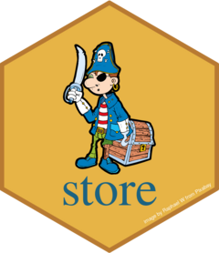

<!-- README.md is generated from README.Rmd. Please edit that file -->

```{r, include = FALSE}
knitr::opts_chunk$set(
  collapse = TRUE,
  comment = "#>",
  fig.path = "man/figures/README-",
  out.width = "100%"
)
```

<br />



<!-- badges: start -->

[](https://lifecycle.r-lib.org/articles/stages.html#stable)
[](https://app.codecov.io/gh/gcfrench/store?branch=master)

<!-- badges: end -->

## Overview

This personal package is a place to the store functions and lookups that
I have created overtime and may find useful in the future. I started
creating it after reading a blog [Writing a Personal R
Package](https://www.jumpingrivers.com/blog/personal-r-package/) from
[Jumping Rivers](https://www.jumpingrivers.com/) which encouraged
spending time putting your personal library of code in one place within
a package.

Writing packages along with their documentation have become easier with
the production of a number of packages from
[RStudio](https://rstudio.com/), including
[devtools](https://devtools.r-lib.org/),
[usethis](https://usethis.r-lib.org/) and
[pkgdown](https://pkgdown.r-lib.org/) and I have used these packages in
developing this personal package. In addition
[Thinkr](https://rtask.thinkr.fr/) created the
[golem](https://thinkr-open.github.io/golem/) package as a aid for
creating shiny packages. A summary of the use of functions within these
packages is provided in **Create and update a package** document in the
information section.

## Installation

The package can be installed from GitHub, which also hosts the [package
site](https://gcfrench.github.io/store)

```{r, eval = FALSE}
devtools::install_github("gcfrench/store")
```

## Usage

The **information section** is the place where my useful documents are
stored. These documents provide information and guidance when writing R
scripts, for example **creating and updating a R package**.

The **reporting section** contains the information and examples on
creating reports using R Markdown and the **statistics section** notes
on applying statistical methods to the data.

The **lookups and functions** section contain my useful functions and
lookup tables. These can be used either directly by installing and
loading this package or by copying and pasting the R code from the
package's data-raw or R sub-directories, available from the package's
GitHib pages, into your R script. The functions contain examples within
their documentation to demonstrate their use.

The **versions** section lists the version history of this package,
along with a summary of the documents, lookups and functions added.

Links to both **my twitter account**, where I retweet or like R related
tweets posted by other members of the R community or with a \#rstats
hashtag and the **package's Github pages** are provided in the top right
hand corner.

## Publication

The store package has been published to [GitHub
pages](https://gcfrench.github.io/store).
